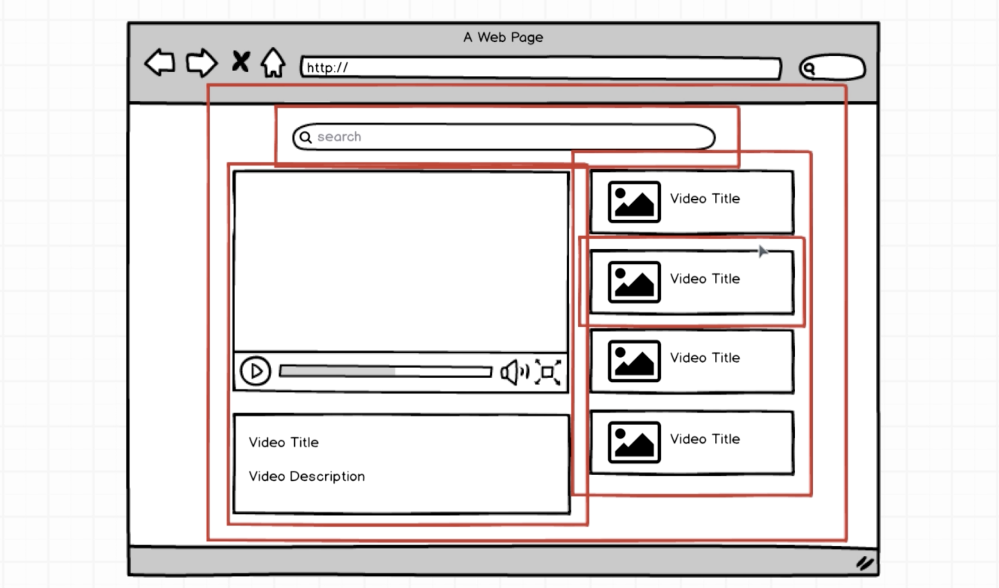

# React-Redux

> [모던 리액트(React)와 리덕스(Redux)](https://www.udemy.com/react-redux/) 강의를 위한 실습 기록 저장소.

> 기존의 강의에서 제공되는 기본적인 설정(웹팩, 바벨 등)이 되어있는 프로젝트를 클론하여 사용하였다. [[기존 프로젝트](_README.md)]

> 2020년쯤 중도에 멈춰진 학습을 이어서 하는 중...😿 ㅎㅇㅌ 🚀

> **참고** 이 강의는 2017년12월에 마지막 업데이트가 이루어졌다. 그렇기 때문에 여기서 사용하고 있는 문법이나 플로우, 특히 버전이 지금과 약간 다를 수 있다. (예를 들어서 여기선 class 컨퍼넌트를 사용하지만, 최근에 많은 부분 함수형 컴퍼넌트를 주로 사용한다.) 하지만 중요한 것은 그 기반은 같다라는 점이고 기술의 과거를 알면 현재 왜 이렇게 사용되고 있는지를 이해하는데 도움이 될 수 있다고 생각한다.

## Basic React

> Section 1 / 2

- Youtube clone

  

## Basic Redux

> Section 3 / 4

## Intermediate Redux

> Section 5

## React-Router & Redux-Form

> Section 6 (Update Version : Section 9)

## Redux-Thunk

> Section 7
