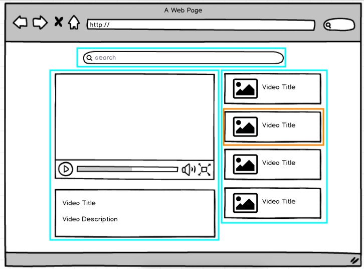

# React-Redux

Log 📖 

 
2020 5월 스터디 
PAUSE 😭 
2021 11월 다시 시작! 
 

 

> [모던 리액트(React)와 리덕스(Redux)](https://www.udemy.com/react-redux/) 강의를 위한 실습 기록 저장소.

> ~~기존의 강의에서 제공되는 기본적인 설정(웹팩, 바벨 등)이 되어있는 프로젝트를 클론하여 사용하였다. [[기존 프로젝트](_README.md)]~~ → 해당 프로젝트가 너무 오래되어서(2017년) 버전이 안맞는 것들이 많은 관계로 나름 웹팩과 바벨 설정을 다시 하여 진행하였다. 🤪 설정은 어렵다...

> 맨 처음 리액트와 리덕스를 배울 때, 해당 강의를 시작하였으나, 마무리 하지 못하여서 이번 기회에 지금까지 내가 알아왔던 리액트의 내용들에 대해서 복습 하며 다시 리얼 마무리를 해보고자 한다.

## Section1/2 : Fundamental React

> Preview : 섹션 1/2에서 구현할 내용

