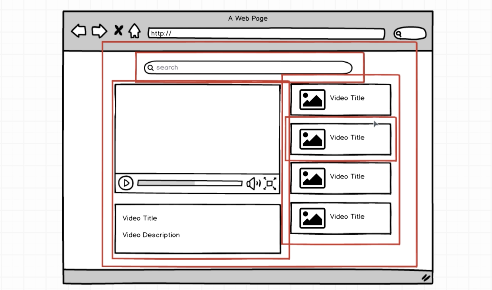

# React-Redux

> 리액트와 리덕스에 대해서 알아보자

> 학습 레퍼런스

-   [모던 리액트(React)와 리덕스(Redux)](https://www.udemy.com/react-redux/) 강의
-   [React Official Site](https://ko.reactjs.org/)
-   [Redux Official Site](https://ko.redux.js.org/)

> 실습 과정을 기록으로 남긴다.

> 기존의 강의에서 제공되는 기본적인 설정(웹팩, 바벨 등)이 되어있는 프로젝트를 클론하여 사용하였다. [[기존 프로젝트](_README.md)]

## MiniProject1

> 리액트로 만든 Youtube Video 리스트

